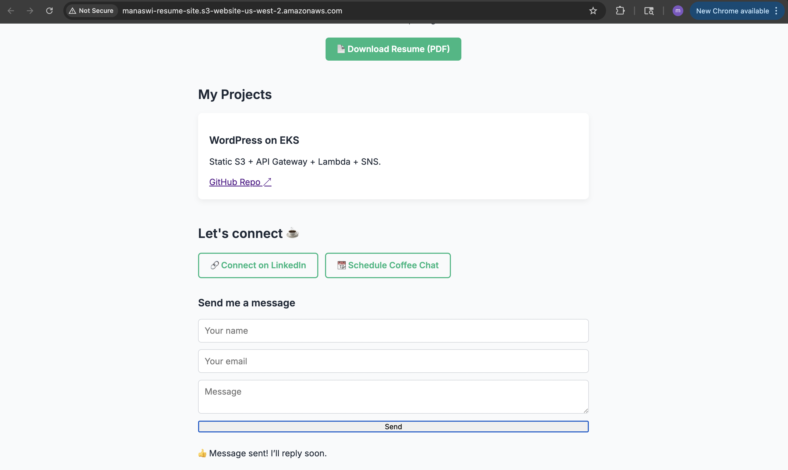
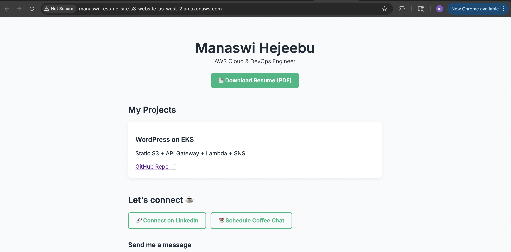

# Manaswi Resume & Contact Site  🌐

Live demo → **<http://manaswi-resume-site.s3-website-us-west-2.amazonaws.com>**

A lightweight personal resume site built on the AWS Free Tier.  
Visitors can download my PDF resume and send me a message—no server rent, no EC2 bills.

---

## ✨ Features

| Feature | AWS Service |
|---------|-------------|
| Static website hosting | **S3** |
| Contact form API       | **API Gateway** |
| Serverless backend     | **AWS Lambda** |
| Email notifications    | **SNS** |
| Zero-cost infra        | All services stay inside Free Tier |

---

## 🛠️ Tech Stack

* HTML / CSS / vanilla JS
* **AWS S3** – static hosting  
* **API Gateway (HTTP API)** – `/contact` POST endpoint  
* **Lambda (Python 3.12)** – sends data to …  
* **SNS** – emails me the message  
* **IAM** – least-privilege role for Lambda

---

## 📸 Screenshots

| Contact Form | SNS Email |
|--------------|-----------|
|  |  |
   |


---

## 💸 Cost
|Service	| Expected monthly cost|
|-----------|----------------------|
|S3, Lambda, API Gateway, SNS|	$0.00 (Free Tier)|

## Cleanup

aws s3 rb s3://manaswi-resume-site --force
aws apigatewayv2 delete-api --api-id <id>
aws lambda delete-function --function-name contactFormHandler
aws sns delete-topic --topic-arn <arn>
aws iam delete-role --role-name LambdaContactRole


## 🚀 Deploy from scratch (summary)

```bash
git clone https://github.com/manaswihejeebu/resume-site.git
cd resume-site
npm install         
aws s3 mb s3://manaswi-resume-site
aws s3 sync . s3://manaswi-resume-site --exclude ".git/*"
